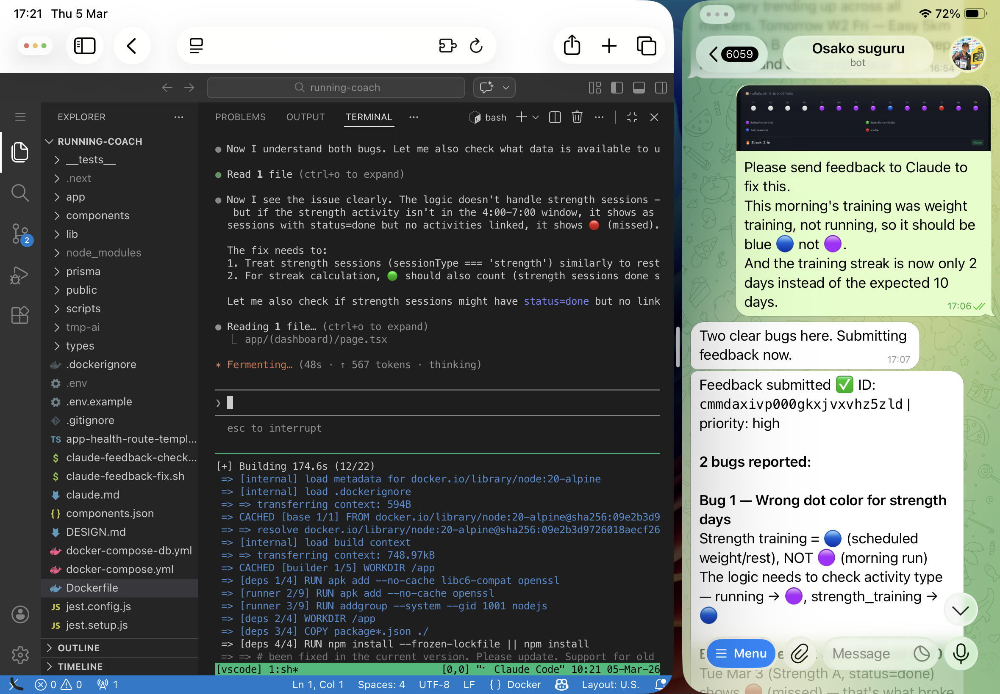

# Safehouse

A Docker Compose suite for personal AI-driven development on your server, accessible from anywhere, any device — chat via Telegram, SSH in from a terminal, open a browser on an iPad, or connect VS Code. It is engineered for always-on productivity, where sleep becomes effectively deprecated.



## Stack

| Service | Description |
|---------|-------------|
| `dev-server` | Ubuntu 24.04 — SSH + code-server + Claude Code + tmux + GitHub CLI + Docker CLI |
| `caddy` | Reverse proxy with automatic HTTPS (optional) |
| `docker-builder` | Docker-in-Docker for building images inside dev-server (optional) |

---

## AI

### Claude Code
The dev-server comes with [Claude Code](https://github.com/anthropics/claude-code) pre-installed. It runs directly in your terminal inside the container — write code, run commands, and iterate with AI without leaving your shell.

### Claude Gateway
[Claude Gateway](https://github.com/0xMaxMa/claude-gateway) lets you interact with Claude Code through messaging apps like Telegram — delegate tasks from anywhere.

---

## Setup

### 1. Configure environment

```bash
cp .env.example .env
```

Edit `.env`:

```env
SSH_PORT=2222
CODE_SERVER_PORT=8080
DEV_USER=dev
DEV_USER_PASSWORD=your-strong-password   # Change this

HOST_HOME=./data
```

### 2. Start services

```bash
make start
```

## Connecting to dev-server

### Browser (code-server)

[http://localhost:8080](http://localhost:8080) — password is `DEV_USER_PASSWORD` from `.env`

### VS Code Remote-SSH

Add to `~/.ssh/config`:

```
Host safehouse
  HostName YOUR_SERVER_IP
  User dev
  Port 2222
```

Install the **Remote - SSH** extension, then connect to `safehouse`.

### Terminal

```bash
ssh dev@127.0.0.1 -p 2222
```

On login, a tmux session picker appears:

```
Select tmux session  (↑↓ move · Enter select · d delete)

  ▌ main
    myproject
    [+ new session]
```

To re-open the picker at any time (inside or outside tmux):

```bash
tmux-select   # or ts
```

---

## Makefile commands

```bash
make start                # Start all services
make stop                 # Stop and remove containers
make restart              # Restart all containers
make build                # Rebuild dev-server image (no cache)
make logs                 # Follow container logs
make update-password      # Change SSH + code-server password
make clear-known-hosts    # Clear SSH known_hosts entry for dev-server
make docker-builder-start # Start Docker-in-Docker builder
make docker-builder-stop  # Stop Docker-in-Docker builder
make caddy-start          # Start Caddy reverse proxy
make caddy-stop           # Stop Caddy reverse proxy
```

---

## Docker-in-Docker builder (optional)

Allows building Docker images from inside dev-server without a host Docker socket.

```bash
make docker-builder-start
```

`DOCKER_HOST=tcp://docker-builder:2375` is pre-configured inside dev-server and automatically available in SSH login sessions.

---

## Persistence

The entire `HOST_HOME` directory is volume-mounted as the dev user's home:

```
HOST_HOME/  →  /home/dev/  (inside container)
```

| Host path | Contents |
|-----------|----------|
| `data/.claude/` | Claude Code auth and config |
| `data/.config/code-server/` | VS Code settings and extensions |
| `data/.config/tmux/` | tmux config |
| `data/.docker/` | Docker Hub credentials |
| `data/.ssh/` | SSH keys and authorized_keys |
| `data/projects/` | Your projects |

---

## HTTPS (optional)

Uncomment the relevant block in `Caddyfile`:

```
code.yourdomain.com {
    reverse_proxy dev-server:8080
}

```

Then run:

```bash
make caddy-start
```

TLS certificates are provisioned automatically via Let's Encrypt.

---

## Security

- Set a strong `DEV_USER_PASSWORD` before starting — never use the default
- For production: use SSH key auth and disable password login, restrict ports with a firewall, enable HTTPS, consider access via VPN or Tailscale
